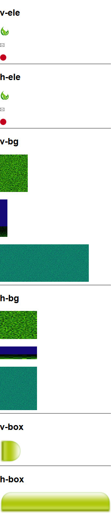

## Step01：开始使用

1. 准备工作

  * 确保已安装 [Nodejs](https://nodejs.org/download/) （推荐 v0.10.x 及以上版本）

1. 入门使用（以操作 `demo` 目录为例）

  ```
  demo
    |
    |- index.html
    |
    |- images
    |   |
    |   |- h-bg
    |   |- h-box
    |   |- h-ele
    |   |- v-bg
    |   |- v-box
    |   `- v-ele
    |
    `- node-abc
        |
        |- node-ab-ccss.js              # 主程序入口          [3]
        |- node-ab-ccss-files.txt       # 文件列表            [2]
        |
        |- node-ab-ccss-start-mac       # mac 的执行程序      [4]
        |- node-ab-ccss-install-mac     # mac 的安装程序      [1]
        |
        |- node-ab-ccss-start.bat       # windows 的执行程序  [4]
        `- node-ab-ccss-install.bat     # windows 的安装程序  [1]
  ```

  * 删除不必要的文件（可选）

    * Windows 平台：请删除`node-ab-ccss-start-mac` `node-ab-ccss-install-mac`
    * Mac 平台：请删除`node-ab-ccss-start.bat` `node-ab-ccss-install.bat`

  * Mac 用户需对文件赋权（Windows 用户请忽略）

    对 `node-ab-ccss-install-mac` 和 `node-ab-ccss-start-mac` 进行赋权，命令可为 `chmod u+x filename`（filename为对应的文件名）

  * [1] 安装 `node-ab-ccss`

    * Windows 平台：点击 `node-ab-ccss-install.bat`
    * Mac 平台：点击 `node-ab-ccss-install-mac`

    > 等同于在 `demo` 目录运行 cmd 命令 `npm install node-ab-ccss`

  * [2] 编辑好`文件列表`所需的目标目录、生成文件、操作参数（可选）

  * [3] 如有需要可修改`主程序入口`（可选）

    > 函数 `ccss.run` 的使用请查看下方 "使用建议"

  * [4] 下载成功后，运行程序

    * Windows 平台：点击 `node-ab-ccss-start.bat`
    * Mac 平台：点击 `node-ab-ccss-start-mac`

    > 等同于在 `demo` 目录运行 cmd 命令 `node node-ab-ccss`

  * 运行成功后，目录结构如下：

    ```
    demo
      |
      |- index.html
      |
      |- img
      |   |- h-bg.png
      |   |- h-box.png
      |   |- h-ele.png
      |   |- v-bg.png
      |   |- v-box.png
      |   `- v-ele.png
      |
      |- css
      |   `- combine.css
      |
      `- node-abc
    ```

  * 打开 `demo/index.html` 文件，应如下所示：

    

1. 使用建议

    * 建议的目录结构：

      ```
      project
          |- website
          |
          `- node-abc                          # 命名随意，最好是英文
               |- node-ab-ccss.js              # 主程序入口
               |- node-ab-ccss-start.bat       # windows 的执行程序
               |- node-ab-ccss-install.bat     # windows 的安装程序
               `- node-ab-ccss-files.txt       # 文件列表
      ```

    * `node-ab-ccss.js` 文件的 `ccss.run` 解释：

      ```
      /**
       * 主程序入口
       *
       * @param {string} websiteRootPath          : [] "网站根目录" 路径
       * @param {string} optFilePathRelativedRoot : [] 相对于 "网站根目录" 的 "文件列表" 路径
       */

      ccss.run(websiteRootPath, optFilePathRelativedRoot)
      ```
