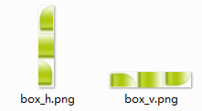

## Step02：使用场景

### 备注说明：

* 场景使用的文件基于 demo 中存在的文件

* 场景所提及的 `执行程序` 等同于点击 `node-ab-ccss-start.bat`（或 `node-ab-ccss-start-mac`） 

* 在进行 1 个场景的测试前，请自行进行重置相关文件

___

### 场景01：添加 / 删除元素

对指定文件夹中的图片进行**删除**，其信息不会出现在生成文件中（img/h-box.png 和 css/combine.css）

```
demo/images/h-box/input.jpg
    ↓
（删除）
    ↓
（执行程序）
```

在指定文件夹**添加**图片，其信息会出现在生成文件中（img/h-box.png 和 css/combine.css）

```
demo/images/h-box
  	↓
（添加）
   	↓
demo/images/h-box/input_other.jpg
    ↓
（执行程序）
```

**注意事项**：

* 请不要用中文命名

* 文件名与生成的 `class` 名直接挂钩

___

### 场景02：频繁变更名称

对指定文件夹的某图片进行**重命名**操作，其最新信息会出现在生成文件中（img/h-box.png 和 css/combine.css）

```
demo/images/h-box/input.jpg
    ↓
（改名）
    ↓
demo/images/h-box/input_new.jpg
    ↓
（执行程序）
```

**注意事项**：

* 请不要用中文命名

___

### 场景03：固定顺序（图片文件名中前置数字加空格的使用）

如需固定某些图片的顺序，可在**文件名前添加数字和空格**

如下操作，即可让 logo 图片和对应的 class 值排在第 1 位

```
demo/images/h-box/logo#pos=right.png
    ↓
（改名）
    ↓
demo/images/h-box/001 logo#pos=right.png
    ↓
（执行程序）
```

**注意事项**：

* 程序会自动删除文件名前的数字和空格，从而达到固序的目的

___

### 场景04：屏蔽图片（图片文件名中前置 `#` 的使用）

如想不操作某些图片，可在**文件名前添加 `#` 号**

如下操作，logo 图片和 class 值就不会出现在生成文件中（img/h-box.png 和 css/combine.css）

```
demo/images/h-box/logo#pos=right.png
    ↓
（改名）
    ↓
demo/images/h-box/#logo#pos=right.png
```

**注意事项**：

* 第一个 `#` 号前不能有空格，而且事例中，前后两个 `#` 的作用是不同的，稍后作解释

___

### 场景05：排列元素（参数 `type` 和后置 `#` 的使用）

* `demo/node-abc/node-ab-ccss.js` 内容为：

  ```
  var ccss = require("node-ab-ccss");

  ccss.run(__dirname + "/../", "/node-abc/node-ab-ccss-files.txt", "text");
  ```

##### 竖直排列（v-ele）

###### 生成前：

* 目录结构：

  ```
  demo
    |
    |- images/v-ele
    |   |
    |   |- icon_leaf_v.png
    |   |- icon_mail_green_v.png
    |   `- icon_num_red_v.png
    |
    `- node-abc
  ```

* demo/images/v-ele

  
  
  源文件：
  * [icon_leaf.png](images/icon_leaf.png)
  * [icon_mail_green.png](images/icon_mail_green.png)
  * [icon_num_red.png](images/icon_num_red.png)

* demo/node-abc/node-ab-ccss-files.txt

  ```
  /images/v-ele
      /img/v-ele.png
      /css/combine.css
      {"type":"v-ele", "sep":0, "comment":"竖直排列（v-ele）"}
  ```

###### 生成后：

* 目录结构

  ```
  demo
    |
    |- images/v-ele
    |   |
    |   |- icon_leaf_v.png
    |   |- icon_mail_green_v.png
    |   `- icon_num_red_v.png
    |
    |- css
    |   |
    |   `- combine.css
    |
    |- img
    |   |
    |   `- v-ele.png
    |
    `- node-abc
  ```

* demo/img/v-ele.png

  

* demo/css/combine.css

  ```
  /**
   * 竖直排列
   */

  .icon_leaf_v,
  .icon_mail_green_v,
  .icon_num_red_v {background:url(../img/v-ele.png) no-repeat;}
  .icon_leaf_v {width:26px;height:27px;background-position:0 -0px;}
  .icon_mail_green_v {width:12px;height:9px;background-position:0 -27px;}
  .icon_num_red_v {width:17px;height:17px;background-position:0 -36px;}
  ```

##### 水平排列（h-ele）

###### 生成前：

* 目录结构：

  ```
  demo
    |
    |- images/h-ele
    |   |
    |   |- icon_leaf_h.png
    |   |- icon_mail_green_h.png
    |   `- icon_num_red_h.png
    |
    `- node-abc
  ```

* demo/images/h-ele

  
  
  源文件：
  * [icon_leaf.png](images/icon_leaf.png)
  * [icon_mail_green.png](images/icon_mail_green.png)
  * [icon_num_red.png](images/icon_num_red.png)

* demo/node-abc/node-ab-ccss-files.txt

  ```
  /images/h-ele
      /img/h-ele.png
      /css/combine.css
      {"type":"h-ele", "sep":0, "comment":"水平排列（h-ele）"}
  ```

###### 生成后：

* 目录结构

  ```
  demo
    |
    |- images/h-ele
    |   |
    |   |- icon_leaf_h.png
    |   |- icon_mail_green_h.png
    |   `- icon_num_red_h.png
    |
    |- css
    |   |
    |   `- combine.css
    |
    |- img
    |   |
    |   `- h-ele.png
    |
    `- node-abc
  ```

* demo/img/h-ele.png

  

* demo/css/combine.css

  ```
  /**
   * 水平排列（h-ele）
   */

  .icon_leaf_h,
  .icon_mail_green_h,
  .icon_num_red_h {background:url(../img/h-ele.png) no-repeat;}
  .icon_leaf_h {width:26px;height:27px;background-position:-0px 0;}
  .icon_mail_green_h {width:12px;height:9px;background-position:-26px 0;}
  .icon_num_red_h {width:17px;height:17px;background-position:-38px 0;}
  ```

##### 竖直拉伸的背景（v-bg）

###### 生成前：

* 目录结构：

  ```
  demo
    |
    |- images/v-bg
    |   |
    |   |- bg_gass_v.png
    |   |- bg_glass_sep_v.png
    |   `- bg_tab_v.png
    |
    `- node-abc
  ```

* demo/images/v-bg

  
  
  源文件：
  * [bg_gass.png](images/bg_gass.png)
  * [bg_glass_sep.png](images/bg_glass_sep.png)
  * [bg_tab.png](images/bg_tab.png)

* demo/node-abc/node-ab-ccss-files.txt

  ```
  /images/v-bg
      /img/v-bg.png
      /css/combine.css
      {"type":"v-bg", "sep":0, "comment":"竖直拉伸的背景（v-bg）"}
  ```

###### 生成后：

* 目录结构

  ```
  demo
    |
    |- images/v-bg
    |   |
    |   |- bg_gass_v.png
    |   |- bg_glass_sep_v.png
    |   `- bg_tab_v.png
    |
    |- css
    |   |
    |   `- combine.css
    |
    |- img
    |   |
    |   `- v-bg.png
    |
    `- node-abc
  ```

* demo/img/v-bg.png

  

* demo/css/combine.css

  ```
  /**
   * 竖直拉伸的背景（v-bg）
   */

  .bg_gass_v,
  .bg_glass_sep_v,
  .bg_tab_v {background:url(../img/v-bg.png) repeat-y;}
  .bg_gass_v {background-position:-0px 0;max-width:75px;}
  .bg_glass_sep_v {background-position:-75px 0;max-width:20px;}
  .bg_tab_v {background-position:-95px 0;max-width:240px;}
  ```

##### 水平拉伸的背景（h-bg）

###### 生成前：

* 目录结构：

  ```
  demo
    |
    |- images/h-bg
    |   |
    |   |- bg_gass_h.png
    |   |- bg_glass_sep_h.png
    |   `- bg_tab_h.png
    |
    `- node-abc
  ```

* demo/images/h-bg

  
  
  源文件：
  * [bg_gass.png](images/bg_gass.png)
  * [bg_glass_sep.png](images/bg_glass_sep.png)
  * [bg_tab.png](images/bg_tab.png)

* demo/node-abc/node-ab-ccss-files.txt

  ```
  /images/h-bg
      /img/h-bg.png
      /css/combine.css
      {"type":"h-bg", "sep":0, "comment":"水平拉伸的背景（h-bg）"}
  ```

###### 生成后：

* 目录结构

  ```
  demo
    |
    |- images/h-bg
    |   |
    |   |- bg_gass_h.png
    |   |- bg_glass_sep_h.png
    |   `- bg_tab_h.png
    |
    |- css
    |   |
    |   `- combine.css
    |
    |- img
    |   |
    |   `- h-bg.png
    |
    `- node-abc
  ```

* demo/img/h-bg.png

  

* demo/css/combine.css

  ```
  /**
   * 水平拉伸的背景（h-bg）
   */

  .bg_gass_h,
  .bg_glass_sep_h,
  .bg_tab_h {background:url(../img/h-bg.png) repeat-x;}
  .bg_gass_h {background-position:0 -0px;min-height:75px;}
  .bg_glass_sep_h {background-position:0 -75px;min-height:34px;}
  .bg_tab_h {background-position:0 -109px;min-height:116px;}
  ```

##### 竖直可延伸的嵌套（v-box）

###### 生成前：

* 目录结构：

  ```
  demo
    |
    |- images/v-box
    |   |
    |   |- indexSideBox_box#pos=middle.png
    |   |- indexSideBox_inner#pos=bottom.png
    |   `- indexSideBox.png
    |
    `- node-abc
  ```

* demo/images/v-box

  
  
  源文件：
  * [indexSideBox.png](indexSideBox.png)
  * [indexSideBox_box#pos=middle.png](indexSideBox_box#pos=middle.png)
  * [indexSideBox_inner#pos=bottom.png](indexSideBox_inner#pos=bottom.png)

* demo/node-abc/node-ab-ccss-files.txt

  ```
  /images/v-box
      /img/v-box.png
      /css/combine.css
      {"type":"v-box", "sep":0, "comment":"竖直可延伸的嵌套（v-box）"}
  ```

###### 生成后：

* 目录结构

  ```
  demo
    |
    |- images/v-box
    |   |
    |   |- indexSideBox_box#pos=middle.png
    |   |- indexSideBox_inner#pos=bottom.png
    |   `- indexSideBox.png
    |
    |- css
    |   |
    |   `- combine.css
    |
    |- img
    |   |
    |   `- v-box.png
    |
    `- node-abc
  ```

* demo/img/v-box.png

  

* demo/css/combine.css

  ```
  /**
   * 竖直可延伸的嵌套（v-box）
   */

  .indexSideBox_box,
  .indexSideBox_inner,
  .indexSideBox {background:url(../img/v-box.png);}
  .indexSideBox_box {width:56px;background-repeat:repeat-y;background-position:-0px 0;}
  .indexSideBox_inner {width:56px;background-repeat:no-repeat;background-position:-56px bottom;padding-bottom:31px;}
  .indexSideBox {width:56px;background-repeat:no-repeat;background-position:-112px 0;padding-top:30px;}
  ```
  
* 针对的 html 结构

  ```
  <!-- 结构1 -->
  <div class="indexSideBox_v">
      <div class="indexSideBox_inner_v">
          <div class="indexSideBox_box_v"></div>
      </div>
  </div>
  
  <!-- 结构2 -->
  <div class="box">
      <div class="indexSideBox_v"></div>
      <div class="indexSideBox_box_v"></div>
      <div class="indexSideBox_inner_v"></div>
  </div>
  ```

##### 水平可延伸的嵌套（h-box）

###### 生成前：

* 目录结构：

  ```
  demo
    |
    |- images/h-box
    |   |
    |   |- indexHeadBox_box#pos=middle.png
    |   |- indexHeadBox.png
    |   `- indexHeadBox_inner#pos=right.png
    |
    `- node-abc
  ```

* demo/images/h-box

  
  
  源文件：
  * [indexHeadBox.png](indexHeadBox.png)
  * [indexHeadBox_box#pos=middle.png](indexHeadBox_box#pos=middle.png)
  * [indexHeadBox_inner#pos=right.png](indexHeadBox_inner#pos=right.png)

* demo/node-abc/node-ab-ccss-files.txt

  ```
  /images/h-box
      /img/h-box.png
      /css/combine.css
      {"type":"h-box", "sep":0, "comment":"水平可延伸的嵌套（h-box）"}
  ```

###### 生成后：

* 目录结构

  ```
  demo
    |
    |- images/h-box
    |   |
    |   |- indexHeadBox_box#pos=middle.png
    |   |- indexHeadBox.png
    |   `- indexHeadBox_inner#pos=right.png
    |
    |- css
    |   |
    |   `- combine.css
    |
    |- img
    |   |
    |   `- h-box.png
    |
    `- node-abc
  ```

* demo/img/h-box.png

  

* demo/css/combine.css

  ```
  /**
   * 水平可延伸的嵌套（h-box）
   */

  .indexHeadBox_box,
  .indexHeadBox,
  .indexHeadBox_inner {background:url(../img/h-box.png);}
  .indexHeadBox_box {height:56px;background-repeat:repeat-x;background-position:0 -0px;}
  .indexHeadBox {height:56px;background-repeat:no-repeat;background-position:0 -56px;padding-left:30px;}
  .indexHeadBox_inner {background-repeat:no-repeat;background-position:right -112px;height:56px;padding-right:31px;}
  ```

* 针对的 html 结构

  ```
  <!-- 结构1 -->
  <div class="indexHeadBox">
      <div class="indexHeadBox_inner">
          <div class="indexHeadBox_box"></div>
      </div>
  </div>
  
  <!-- 结构2 -->
  <div class="box">
      <div class="indexHeadBox"></div>
      <div class="indexHeadBox_box"></div>
      <div class="indexHeadBox_inner"></div>
  </div>
  
  <!-- 结构2-补充样式 -->
  <style>
      .box indexHeadBox {float: left;}
      .box indexHeadBox_inner {float: right;}
  </style>
  ```

___

### 场景06：多目录协作处理（参数 `include` 的使用）

###### 生成前：

* 目录

  ```
  demo
    |
    |- images
    |   |
    |   |- h-box
    |   |   |
    |   |   |- indexHeadBox.png
    |   |   |- indexHeadBox_box#pos=middle.png
    |   |   `- indexHeadBox_inner#pos=right.png
    |   |
    |   `- v-box
    |       |
    |       |- indexSideBox.png
    |       |- indexSideBox_box#pos=middle.png
    |       `- indexSideBox_inner#pos=bottom.png
    |
    |- node-abc-include
    |   |
    |   |- part-01.txt
    |   `- part-02.txt
    |
    `- node-abc
  ```

* demo/node-abc/node-ab-ccss-files.txt

  ```
  {"include":["node-abc-include/part-01.txt", "node-abc-include/part-02.txt"]}
  ```

* demo/node-ab-ccss-include/part-01.txt

  ```
  /images/h-box
      /img/h-box.png
      /css/combine.css
      {"type":"h-box", "sep":0, "comment":"水平可延伸的嵌套（h-box）"}
  ```

* demo/node-ab-ccss-include/part-02.txt

  ```
  /images/v-box
      /img/v-box.png
      /css/combine.css
      {"type":"v-box", "sep":0, "comment":"竖直可延伸的嵌套（v-box）"}
  ```

* demo/images/h-box

  
  
  源文件：
  * [indexHeadBox.png](indexHeadBox.png)
  * [indexHeadBox_box#pos=middle.png](indexHeadBox_box#pos=middle.png)
  * [indexHeadBox_inner#pos=right.png](indexHeadBox_inner#pos=right.png)

* demo/images/v-box

  
  
  源文件：
  * [indexSideBox.png](indexSideBox.png)
  * [indexSideBox_box#pos=middle.png](indexSideBox_box#pos=middle.png)
  * [indexSideBox_inner#pos=bottom.png](indexSideBox_inner#pos=bottom.png)

###### 生成后：

* 目录

  ```
  demo
    |
    |- images
    |
    |- node-abc-include
    |
    |- css
    |   |
    |   `- combine.css
    |
    |- img
    |   |
    |   |- h-box.png
    |   `- v-box.png
    |
    `- node-abc
  ```

* demo/img

  

* demo/css/combine.css

  ```
  /**
   * 竖直可延伸的嵌套（v-box）
   */

  .indexSideBox_box,
  .indexSideBox_inner,
  .indexSideBox {background:url(../img/v-box.png);}
  .indexSideBox_box {width:56px;background-repeat:repeat-y;background-position:-0px 0;}
  .indexSideBox_inner {width:56px;background-repeat:no-repeat;background-position:-56px bottom;padding-bottom:31px;}
  .indexSideBox {width:56px;background-repeat:no-repeat;background-position:-112px 0;padding-top:30px;}


  /**
   * 竖直可延伸的嵌套（v-box）
   */

  .indexSideBox_box,
  .indexSideBox_inner,
  .indexSideBox {background:url(../img/v-box.png);}
  .indexSideBox_box {width:56px;background-repeat:repeat-y;background-position:-0px 0;}
  .indexSideBox_inner {width:56px;background-repeat:no-repeat;background-position:-56px bottom;padding-bottom:31px;}
  .indexSideBox {width:56px;background-repeat:no-repeat;background-position:-112px 0;padding-top:30px;}
  ```

**注意事项：**

* `demo/node-abc/node-ab-ccss-files.txt` 中的头部参数必须要写成一行，不能有换行符

* `include` 参数仅支持数组类型，其子元素除了支持字符串格式外，还支持对象格式，但不建议这样使用

___

### 场景07：同图多 class 输出（文件名中的 `&&` 、参数 `extend` 和后置 `#` 的使用）

* 命名式：

  ```
  test/src-img/box_v/indexSideBox.png
      ↓
  （改名）
      ↓
  test/src-img/box_v/newClass&&indexSideBox.png
  ```

  **生成**

  test/tar-css/ccss.css

  ```
  .newClass,
  .indexSideBox {width:56px;background:url(../tar-img/box_v.png) no-repeat -112px 0;padding-top:30px;}
  ```

  **说明**

  * 例子中，`newclass` 和 `indexSideBox`都会**受到**同样的配置参数影响（如 `pre` `after` 等）

* 文件式：

  ```
  test/src-img/box_v/indexSideBox.png
      ↓
  （改名）
      ↓
  test/src-img/box_v/indexSideBox#extend.txt.png
  ```

  test/src-img/box_v/extend.txt

  ```
  extend
      newclass01
      newclass02
      newclass03
  ```

  **生成**

  test/tar-css/ccss.css

  ```
  .indexSideBox,
  .newClass01,
  .newClass02,
  .newClass03 {width:56px;background:url(../tar-img/box_v.png) no-repeat -112px 0;padding-top:30px;}
  ```

  **说明**

  * 例子中，`newclass01`、`newclass02`、`newclass03` **不受** `indexSideBox` 配置参数影响（如 `pre` `after` 等）

___

### 场景08：多图片输出（参数 `mutilExportImg` 的使用）

demo/node-abc/node-ab-ccss-files.txt

```
/images/v-ele
    /img/v-ele.png
    /css/combine.css
    {"type":"v-ele", "sep":0, "comment":"竖直排列（v-ele）", "mutilExportImg":["v-ele.jpg"]}
```

运行成功后，会在 `test/src-img` 目录生成多一个图片文件 `v-ele.jpg`

**说明：**

* 不支持`gif`输出

___

### 场景09：文件名带版本号（`node-ab-ccss-files.txt` 中 `{$md5}` 等参数的使用）

demo/node-abc/node-ab-ccss-files.txt

```
/images/h-ele
    /img/h-ele-{$md5}.png?v={$now}
    /css/ccss.css
    {"type":"h-ele", "sep":0, "comment":"h-ele 注释", "pre": "#h-ele"}
```

demo/css/ccss.css

```
/**
 * h-ele 注释
 */

#h-ele .icon_leaf,
#h-ele .icon_mail_green,
#h-ele .icon_num_red {background:url(../images/h-ele-1e07bfe2cb09b0fa19f6645d7c60a2cc.png?v=20150305174440) no-repeat;}
#h-ele .icon_leaf {width:26px;height:27px;background-position:-0px 0;}
#h-ele .icon_mail_green {width:12px;height:9px;background-position:-26px 0;}
#h-ele .icon_num_red {width:17px;height:17px;background-position:-38px 0;}
```

支持的版本号类型：

* `{$md5}` : 文件 md5（32个字符，如 1e07bfe2cb09b0fa19f6645d7c60a2cc）

* `{$now}` : 当前生成文件的时间（14个字符，如 20150305174440）