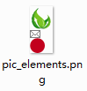
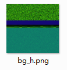

## Step0: 创建 node-ab-ccss的原因

1. 填补空缺；
1. 创建适合团队（或个人）在任开发阶段使用；
1. 适合需求変更频繁；
1. 易学易用；
1. 粘合性高（适合 grunt 等预处理使用）


## Step01：开始使用

1. 确保已安装 [Nodejs](http://nodejs.org/) （推荐 v0.10.x 及以上版本）

1. `demo 目录`

  ```
  demo
    |- images                      # 对应 test/abc-test-src
    |    |- h-bg
    |    |- h-box
    |    |- h-ele
    |    |- v-bg
    |    |- v-box
    |    `- v-ele
    |
    |- node-ab-ccss.js              # 主程序入口          [3]
    |- node-ab-ccss-files.txt       # 文件列表            [2]
    |
    |- node-ab-ccss-start-mac       # mac 的执行程序      [4]
    |- node-ab-ccss-install-mac     # mac 的安装程序      [1]
    |
    |- node-ab-ccss-start.bat       # windows 的执行程序  [4]
    `- node-ab-ccss-install.bat     # windows 的安装程序  [1]
  ```

* [0] 组建 `demo 目录`（`dist 目录` + `test/abc-test-src 目录`）

* 删除对应平台不必要的文件（可选）

  * Windows 平台：请删除`node-ab-ccss-start-mac` `node-ab-ccss-install-mac`
  * Mac 平台：请删除`node-ab-ccss-start.bat` `node-ab-ccss-install.bat`

* Mac 用户需对文件赋权（Windows 用户请忽略）

  对 `node-ab-ccss-install-mac` 和 `node-ab-ccss-start-mac` 进行赋权，命令可为 `chmod u+x filename`（filename为对应的文件名）

* [1] 下载 / 安装 `node-ab-ccss`

  * Windows 平台：点击 `node-ab-ccss-install.bat`
  * Mac 平台：点击 `node-ab-ccss-install-mac`

  > 也可以在 demo 目录运行 cmd 命令 `npm install node-ab-ccss`

* [4] 下载成功后，运行程序

  * Windows 平台：点击 `node-ab-ccss-start.bat`
  * Mac 平台：点击 `node-ab-ccss-start-mac`

  > 也可以在 demo 目录运行 cmd 命令 `node node-ab-ccss`

* [2] **编辑好`文件列表`**所需的操作目录、生成文件、操作参数（可选）

* [3] 如有需要可修改`主程序入口`（可选）

  > 函数 `ccss.run(websiteRootPath, optFilePathRelativedRoot)` 的第 1 个参数决定网站根目录

* [4] **点击对应系统的`执行程序`**（建议）

  > 也可以在 demo 目录运行 cmd 命令 `node node-ab-ccss`

* 运行成功后，会生成对应的目录和文件

  ```
  demo
    |- ...
    |
    |- img
    |   |- photo
    |
    |- css
    |   |- css
    |
    `- ...
  ```

## Step02：使用场景

**注明**：

* 场景使用的文件基于 demo 中存在的文件

* 语句中的 `ccss运行程序` 等同于 `node-ab-ccss-start-mac` 或 `node-ab-ccss-start.bat`

___

### 场景01：添加删除元素

```
demo/images/h-box/input.jpg => 删除
```

如上，对指定文件夹中的图片进行**删除**后，点击`ccss运行程序`，即可在生成图片（img/h-box.png）和 css文件（css/combine.css）中看到结果

```
demo/images/h-box => 添加 demo/images/h-box/input_other.jpg
```

对指定文件夹**添加**图片会，点击`ccss运行程序`，即可在生成图片（img/h-box.png）和 css文件（css/combine.css）中看到结果

**注意事项**：

* 请不要用中文命名

* 文件名与生成的 css 类名直接挂钩

___

### 场景02：频繁变更名称

```
demo/images/h-box/input.jpg => demo/images/h-box/input_new.jpg
```

对 demo/images/h-box（或其他兄弟文件夹）文件夹中的某张图片进行**重命名**操作，点击ccss运行程序，即可在 css/combine.css 中看到新效果

**注意事项**：

* 请不要用中文命名

___

### 场景03：固定顺序

```
demo/images/h-box/logo#pos=right.png => demo/images/h-box/001 logo#pos=right.png
```

如需固定某些图片的顺序，可在**文件名前添加数字和空格**，如上操作，即可让 logo 图片和类名排在第1位

**注意事项**：

* 程序会删除文件名前的数字和空格，从而你可以通过这种手段来让元素固序

___

### 场景04：屏蔽图片

```
demo/images/h-box/logo#pos=right.png => demo/images/h-box/#logo#pos=right.png
```

如想不操作某些图片，可在**文件名前添加 # 号**，如上操作，logo 图片和类名则不出现在生成文件（img/h-box.png、css/combine.css）中

**注意事项**：

* \# 号不能有空格，而且事例中，两个\#的用法是不同，稍后作解释

___

### 场景05：排列元素

* 以 Windows 平台操作为例

* `test/node-ab-ccss.js` 内容为：

  ```
  var ccss = require("node-ab-ccss");

  ccss.run(__dirname, "/node-ab-ccss-files.txt", "text");
  ```

##### 竖直排列（v-ele）

###### 生成前：

* 目录结构：

  ```
  test
    |- node_modules
    |    `- ....
    |
    |- src-img
    |    `- pic_elements
    |        |- icon_leaf.png
    |        |- icon_mail_green.png
    |        `- icon_num_red.png
    |
    |- node-ab-ccss.js
    |- node-ab-ccss-files.txt
    |- node-ab-ccss-install.bat
    `- node-ab-ccss-start.bat
  ```
* test/src-img/pic_elements

  
  源文件：[icon_leaf.png](images/icon_leaf.png)
  源文件：[icon_mail_green.png](images/icon_mail_green.png)
  源文件：[icon_num_red.png](images/icon_num_red.png)

* test/node-ab-ccss-files.txt

  ```
  /src-img/pic_elements
      /tar-img/pic_elements.png
      /tar-css/ccss.css
      {"type":"v-ele", "sep":0, "comment":"竖直排列"}
  ```

###### 生成后：

* 目录结构

  ```
  test
    |- node_modules
    |    `- ....
    |
    |- src-img
    |    `- pic_elements
    |        |- icon_leaf.png
    |        |- icon_mail_green.png
    |        `- icon_num_red.png
    |
    |- tar-css
    |    `- ccss.css
    |
    |- tar-img
    |    `- pic_elements.png
    |
    |- node-ab-ccss.js
    |- node-ab-ccss-files.txt
    |- node-ab-ccss-install.bat
    `- node-ab-ccss-start.bat
  ```

* test/tar-img

  

* test/tar-css/ccss.css

  ```
  /**
   * 竖直排列
   */

  .icon_leaf {width:26px;height:27px;background:url(../tar-img/pic_elements.png) no-repeat 0 -0px;}
  .icon_mail_green {width:12px;height:9px;background:url(../tar-img/pic_elements.png) no-repeat 0 -27px;}
  .icon_num_red {width:17px;height:17px;background:url(../tar-img/pic_elements.png) no-repeat 0 -36px;}
  ```

##### 水平排列（h-ele）

###### 生成前：

* 目录结构：

  ```
  test
    |- node_modules
    |    `- ....
    |
    |- src-img
    |    `- pic_elements
    |        |- icon_leaf.png
    |        |- icon_mail_green.png
    |        `- icon_num_red.png
    |
    |- node-ab-ccss.js
    |- node-ab-ccss-files.txt
    |- node-ab-ccss-install.bat
    `- node-ab-ccss-start.bat
  ```
* test/src-img/pic_elements

  
  源文件：[icon_leaf.png](images/icon_leaf.png)
  源文件：[icon_mail_green.png](images/icon_mail_green.png)
  源文件：[icon_num_red.png](images/icon_num_red.png)

* test/node-ab-ccss-files.txt

  ```
  /src-img/pic_elements
      /tar-img/pic_elements.png
      /tar-css/ccss.css
      {"type":"h-ele", "sep":0, "comment":"水平排列"}
  ```

###### 生成后：

* 目录结构

  ```
  test
    |- node_modules
    |    `- ....
    |
    |- src-img
    |    `- pic_elements
    |        |- icon_leaf.png
    |        |- icon_mail_green.png
    |        `- icon_num_red.png
    |
    |- tar-css
    |    `- ccss.css
    |
    |- tar-img
    |    `- pic_elements.png
    |
    |- node-ab-ccss.js
    |- node-ab-ccss-files.txt
    |- node-ab-ccss-install.bat
    `- node-ab-ccss-start.bat
  ```

* test/tar-img

  

* test/tar-css/ccss.css

  ```
  /**
   * 水平排列
   */

  .icon_leaf {width:26px;height:27px;background:url(../tar-img/pic_elements.png) no-repeat -0px 0;}
  .icon_mail_green {width:12px;height:9px;background:url(../tar-img/pic_elements.png) no-repeat -26px 0;}
  .icon_num_red {width:17px;height:17px;background:url(../tar-img/pic_elements.png) no-repeat -38px 0;}
  ```

##### 竖直拉伸的背景（v-bg）

###### 生成前：

* 目录结构：

  ```
  test
    |- node_modules
    |    `- ....
    |
    |- src-img
    |    `- bv_v
    |        |- bg_gass.png
    |        |- bg_glass_sep.png
    |        `- bg_tab.png
    |
    |- node-ab-ccss.js
    |- node-ab-ccss-files.txt
    |- node-ab-ccss-install.bat
    `- node-ab-ccss-start.bat
  ```

* test/src-img/bv_v

  
  源文件：[bg_gass.png](images/bg_gass.png)
  源文件：[bg_glass_sep.png](images/bg_glass_sep.png)
  源文件：[bg_tab.png](images/bg_tab.png)

* test/node-ab-ccss-files.txt

  ```
  /src-img/bg_v
      /tar-img/bg_v.png
      /tar-css/ccss.css
      {"type":"v-bg", "sep":0, "comment":"竖直拉伸的背景"}
  ```

###### 生成后：

* 目录结构

  ```
  test
    |- node_modules
    |    `- ....
    |
    |- src-img
    |    `- bv_v
    |        |- bg_gass.png
    |        |- bg_glass_sep.png
    |        `- bg_tab.png
    |
    |- tar-css
    |    `- ccss.css
    |
    |- tar-img
    |    `- bv_v.png
    |
    |- node-ab-ccss.js
    |- node-ab-ccss-files.txt
    |- node-ab-ccss-install.bat
    `- node-ab-ccss-start.bat
  ```

* test/tar-img

  

* test/tar-css/ccss.css

  ```
  /**
   * 竖直拉伸的背景
   */

  .bg_gass {background:url(../tar-img/bg_v.png) repeat-y -0px 0;}
  .bg_glass_sep {background:url(../tar-img/bg_v.png) repeat-y -75px 0;}
  .bg_tab {background:url(../tar-img/bg_v.png) repeat-y -95px 0;}
  ```

##### 水平拉伸的背景（h-bg）

###### 生成前：

* 目录结构：

  ```
  test
    |- node_modules
    |    `- ....
    |
    |- src-img
    |    `- bg_h
    |        |- bg_gass.png
    |        |- bg_glass_sep.png
    |        `- bg_tab.png
    |
    |- node-ab-ccss.js
    |- node-ab-ccss-files.txt
    |- node-ab-ccss-install.bat
    `- node-ab-ccss-start.bat
  ```

* test/src-img/bg_h

  
  源文件：[bg_gass.png](images/bg_gass.png)
  源文件：[bg_glass_sep.png](images/bg_glass_sep.png)
  源文件：[bg_tab.png](images/bg_tab.png)

* test/node-ab-ccss-files.txt

  ```
  /src-img/bg_h
      /tar-img/bg_h.png
      /tar-css/ccss.css
      {"type":"h-bg", "sep":0, "comment":"竖直拉伸的背景"}
  ```

###### 生成后：

* 目录结构

  ```
  test
    |- node_modules
    |    `- ....
    |
    |- src-img
    |    `- bv_h
    |        |- bg_gass.png
    |        |- bg_glass_sep.png
    |        `- bg_tab.png
    |
    |- tar-css
    |    `- ccss.css
    |
    |- tar-img
    |    `- bv_h.png
    |
    |- node-ab-ccss.js
    |- node-ab-ccss-files.txt
    |- node-ab-ccss-install.bat
    `- node-ab-ccss-start.bat
  ```

* test/tar-img

  

* test/tar-css/ccss.css

  ```
  /**
   * 水平拉伸的背景
   */

  .bg_gass {background:url(../tar-img/bg_h.png) repeat-x 0 -0px;}
  .bg_glass_sep {background:url(../tar-img/bg_h.png) repeat-x 0 -75px;}
  .bg_tab {background:url(../tar-img/bg_h.png) repeat-x 0 -109px;}
  ```

##### 竖直可延伸的嵌套(v-box)

###### 生成前：

* 目录结构：

  ```
  test
    |- node_modules
    |    `- ....
    |
    |- src-img
    |    `- box_v
    |        |- indexSideBox.png
    |        |- indexSideBox_box#pos=middle.png
    |        `- indexSideBox_inner#pos=bottom.png
    |
    |- node-ab-ccss.js
    |- node-ab-ccss-files.txt
    |- node-ab-ccss-install.bat
    `- node-ab-ccss-start.bat
  ```

* test/src-img/box_v

  
  源文件：[indexSideBox.png](indexSideBox.png)
  源文件：[indexSideBox_box#pos=middle.png](indexSideBox_box#pos=middle.png)
  源文件：[indexSideBox_inner#pos=bottom.png](indexSideBox_inner#pos=bottom.png)

* test/node-ab-ccss-files.txt

  ```
  /src-img/box_h
      /tar-img/box_h.png
      /tar-css/ccss.css
      {"type":"h-box", "sep":0, "comment":"水平可延伸的嵌套"}
  ```

###### 生成后：

* 目录结构

  ```
  test
    |- node_modules
    |    `- ....
    |
    |- src-img
    |    `- box_v
    |        |- indexSideBox.png
    |        |- indexSideBox_box#pos=middle.png
    |        `- indexSideBox_inner#pos=right.png
    |
    |- tar-css
    |    `- ccss.css
    |
    |- tar-img
    |    `- box_v.png
    |
    |- node-ab-ccss.js
    |- node-ab-ccss-files.txt
    |- node-ab-ccss-install.bat
    `- node-ab-ccss-start.bat
  ```

* test/tar-img

  

* test/tar-css/ccss.css

  ```
  /**
   * 竖直可延伸的嵌套
   */

  .indexSideBox {width:56px;background:url(../tar-img/box_v.png) no-repeat -0px 0;padding-top:30px;}
  .indexSideBox_box {width:56px;background:url(../tar-img/box_v.png) repeat-y -56px 0;}
  .indexSideBox_inner {width:56px;background:url(../tar-img/box_v.png) no-repeat -112px bottom;padding-bottom:31px;}
  ```
  
* 针对的 html 结构

  ```
  <!-- 结构1 -->
  <div class="indexSideBox">
      <div class="indexSideBox_inner">
          <div class="indexSideBox_box"></div>
      </div>
  </div>
  
  <!-- 结构2 -->
  <div class="box">
      <div class="indexSideBox"></div>
      <div class="indexSideBox_box"></div>
      <div class="indexSideBox_inner"></div>
  </div>
  ```

##### 水平可延伸的嵌套（h-box）

###### 生成前：

* 目录结构：

  ```
  test
    |- node_modules
    |    `- ....
    |
    |- src-img
    |    `- box_h
    |        |- indexHeadBox.png
    |        |- indexHeadBox_box#pos=middle.png
    |        `- indexHeadBox_inner#pos=right.png
    |
    |- node-ab-ccss.js
    |- node-ab-ccss-files.txt
    |- node-ab-ccss-install.bat
    `- node-ab-ccss-start.bat
  ```

* test/src-img/box_h

  
  源文件：[indexHeadBox.png](indexHeadBox.png)
  源文件：[indexHeadBox_box#pos=middle.png](indexHeadBox_box#pos=middle.png)
  源文件：[indexHeadBox_inner#pos=right.png](indexHeadBox_inner#pos=right.png)

* test/node-ab-ccss-files.txt

  ```
  /src-img/box_h
      /tar-img/box_h.png
      /tar-css/ccss.css
      {"type":"h-box", "sep":0, "comment":"水平可延伸的嵌套"}
  ```

###### 生成后：

* 目录结构

  ```
  test
    |- node_modules
    |    `- ....
    |
    |- src-img
    |    `- box_h
    |        |- indexHeadBox.png
    |        |- indexHeadBox_box#pos=middle.png
    |        `- indexHeadBox_inner#pos=right.png
    |
    |- tar-css
    |    `- ccss.css
    |
    |- tar-img
    |    `- box_h.png
    |
    |- node-ab-ccss.js
    |- node-ab-ccss-files.txt
    |- node-ab-ccss-install.bat
    `- node-ab-ccss-start.bat
  ```

* test/tar-img

  

* test/tar-css/ccss.css

  ```
  /**
   * 水平可延伸的嵌套
   */

  .indexHeadBox {height:56px;background:url(../tar-img/box_h.png) no-repeat 0 -0px;padding-left:30px;}
  .indexHeadBox_box {height:56px;background:url(../tar-img/box_h.png) repeat-x 0 -56px;}
  .indexHeadBox_inner {height:56px;background:url(../tar-img/box_h.png) no-repeat right -112px;padding-right:31px;}
  ```
  
* 针对的 html 结构

  ```
  <!-- 结构1 -->
  <div class="indexHeadBox">
      <div class="indexHeadBox_inner">
          <div class="indexHeadBox_box"></div>
      </div>
  </div>
  
  <!-- 结构2 -->
  <div class="box">
      <div class="indexHeadBox"></div>
      <div class="indexHeadBox_box"></div>
      <div class="indexHeadBox_inner"></div>
  </div>
  
  <!-- 结构2-补充样式 -->
  <style>
      .box indexHeadBox {float: left;}
      .box indexHeadBox_inner {float: right;}
  </style>
  ```

___

### 场景06：多目录协作处理

###### 生成前：

* 目录

  ```
  test
    |- node_modules
    |    `- ....
    |
    |- src-img
    |    |- box_h
    |    |   |- indexHeadBox.png
    |    |   |- indexHeadBox_box#pos=middle.png
    |    |   `- indexHeadBox_inner#pos=right.png
    |    |
    |    `- box_v
    |        |- indexSideBox.png
    |        |- indexSideBox_box#pos=middle.png
    |        `- indexSideBox_inner#pos=bottom.png
    |
    |- src-include
    |    |- node-ab-ccss-files-01.txt
    |    `- node-ab-ccss-files-02.txt
    |
    |- node-ab-ccss.js
    |- node-ab-ccss-files.txt
    |- node-ab-ccss-install.bat
    `- node-ab-ccss-start.bat
  ```

* test/node-ab-ccss-files.txt

  ```
  {"include":["src-include/node-ab-ccss-files-01.txt", "src-include/node-ab-ccss-files-02.txt"]}
  ```

* test/node-ab-ccss-include/node-ab-ccss-files-01.txt

  ```
  /src-img/box_v
      /tar-img/box_v.png
      /tar-css/ccss.css
      {"type":"v-box", "sep":0, "comment":"竖直可延伸的嵌套"}
  ```

* test/node-ab-ccss-include/node-ab-ccss-files-02.txt

  ```
  /src-img/box_h
      /tar-img/box_h.png
      /tar-css/ccss.css
      {"type":"h-box", "sep":0, "comment":"水平可延伸的嵌套"}
  ```

* test/src-img/box_h

  
  源文件：[indexHeadBox.png](indexHeadBox.png)
  源文件：[indexHeadBox_box#pos=middle.png](indexHeadBox_box#pos=middle.png)
  源文件：[indexHeadBox_inner#pos=right.png](indexHeadBox_inner#pos=right.png)

* test/src-img/box_v

  
  源文件：[indexSideBox.png](indexSideBox.png)
  源文件：[indexSideBox_box#pos=middle.png](indexSideBox_box#pos=middle.png)
  源文件：[indexSideBox_inner#pos=bottom.png](indexSideBox_inner#pos=bottom.png)

###### 生成后：

* 目录

  ```
  test
    |- node_modules
    |    `- ....
    |
    |- src-img
    |    |- box_h
    |    |   |- indexHeadBox.png
    |    |   |- indexHeadBox_box#pos=middle.png
    |    |   `- indexHeadBox_inner#pos=right.png
    |    |
    |    `- box_v
    |        |- indexSideBox.png
    |        |- indexSideBox_box#pos=middle.png
    |        `- indexSideBox_inner#pos=bottom.png
    |
    |- src-include
    |    |- node-ab-ccss-files-01.txt
    |    `- node-ab-ccss-files-02.txt
    |
    |- tar-css
    |    `- ccss.css
    |
    |- tar-img
    |    |- box_h.png
    |    `- box_v.png
    |
    |- node-ab-ccss.js
    |- node-ab-ccss-files.txt
    |- node-ab-ccss-install.bat
    `- node-ab-ccss-start.bat
  ```

* test/tar-img

  

* test/tar-css/ccss.css

  ```
  /**
   * 竖直可延伸的嵌套
   */

  .indexSideBox {width:56px;background:url(../tar-img/box_v.png) no-repeat -0px 0;padding-top:30px;}
  .indexSideBox_box {width:56px;background:url(../tar-img/box_v.png) repeat-y -56px 0;}
  .indexSideBox_inner {width:56px;background:url(../tar-img/box_v.png) no-repeat -112px bottom;padding-bottom:31px;}

  /**
   * 水平可延伸的嵌套
   */

  .indexHeadBox {height:56px;background:url(../tar-img/box_h.png) no-repeat 0 -0px;padding-left:30px;}
  .indexHeadBox_box {height:56px;background:url(../tar-img/box_h.png) repeat-x 0 -56px;}
  .indexHeadBox_inner {height:56px;background:url(../tar-img/box_h.png) no-repeat right -112px;padding-right:31px;}
  ```

**注意事项：**

* `test/node-ab-ccss-files.txt` 中的头参数必须要一行书写，不能有换行符，`include` 参数除了支持字符串格式外，还支持对象格式，如上可改写为：

  ```
  {"include": [{"base": {}, "list": [{"fold": "/src-img", "img": "/tar-img/box_v.png", "css": "/tar-css/ccss.css", "opt": {"type": "v-box", "sep": 0, "comment": "竖直可延伸的嵌套"}}, {"base": {}, "list": [{"fold": "/src-img", "img": "/tar-img/box_h.png", "css": "/tar-css/ccss.css", "opt": {"type": "h-box", "sep": 0, "comment": "水平可延伸的嵌套"}}}
  ```
  **不建议**这种写法，有时会触发`Image uninitiated`错误！

___

### 场景07：同图多类输出

* 并列式：

  ```
  test/src-img/box_v/indexSideBox.png => test/src-img/box_v/newClass&&indexSideBox.png
  ```

  **生成**

  test/tar-css/ccss.css

  ```
  .newClass,
  .indexSideBox {width:56px;background:url(../tar-img/box_v.png) no-repeat -112px 0;padding-top:30px;}
  ```

  **说明**

  * 直接在图片文件名中用`&&`进行分割
  * 例子中，`newclass`和`indexSideBox`都会受到同样的前缀（pre）、后缀（after）等影响

* 引用式：

  ```
  test/src-img/box_v/indexSideBox.png => test/src-img/box_v/indexSideBox#extend.txt.png
  ```

  test/src-img/box_v/extend.txt

  ```
  extend
          newclass01
          newclass02
          newclass03
  ```

  **生成**

  test/tar-css/ccss.css

  ```
  .indexSideBox,
  .newClass01,
  .newClass02,
  .newClass03 {width:56px;background:url(../tar-img/box_v.png) no-repeat -112px 0;padding-top:30px;}
  ```

  **说明**

  * 图片文件名需要添加所引用的参数文件，如`filename#fileOptName.fileOptType.fileType`
  * 例子中，`newclass01`、`newclass02`、`newclass03`不受`indexSideBox`的前缀（pre）、后缀（after）等影响

___

### 场景08：多图片输出

test/node-ab-ccss-files.txt

```
/src-img/v-ele
    /tar-img/v-ele.png
    /tar-css/ccss.css
    {"type":"v-ele", "sep":0, "comment":"v-ele 注释||路径为/css/v-ele.css", "mutilExportImg":["v-ele.jpg"]}
```

运行成功后，会在 `test/src-img` 目录生成多一个图片文件 `v-ele.jpg`

**说明：**

* 不支持`gif`输出


## Step3：相关说明

### 文件类型支持

输入：png / jpg / gif
输出：png / jpg

### 相关文件说明

* node-ab-ccss.js

  ```
  var ccss = require("node-ab-ccss");

  ccss.run(__dirname, "/node-ab-ccss-files.txt", "text");
  ```

  ccss.run 参数说明：

  * 第1个参数：根目录路径（这个参数十分重要，直接影响各文件的加载路径）
  * 第2个参数：配置文件路径（以第一个参数的路径为基础）
  * 第3个参数：数据处理方式

### 图片文件名规则

```
[ [ # + ] number + [空格] + ] filename + [ + && + filename + ... ] + [ # + optFilename/key=value[ &&key=value[...] ] ] + . + fileType
```

**事例：**

<table>
  <thead>
    <tr>
      <th>命名样例</th>
      <th>解释</th>
    </tr>
  </thead>
  <tbody>
    <tr>
      <td>\#class.png</td>
      <td>屏蔽图片，不做处理</td>
    </tr>
    <tr>
      <td>001 class.png</td>
      <td>用于固定图片顺序，最终生成的类名还是 `class`</td>
    </tr>
    <tr>
      <td>class&&class01.png</td>
      <td>生成 `class`、`class01` 都使用同样 css 和同样的前缀、后缀等</td>
    </tr>
    <tr>
      <td>image#option.txt.png</td>
      <td>【参数文件方式】 在处理图片时，会加载当前目录的 `option.txt` 文件，其内容经过处理后会成为针对该文件的处理参数。该用法不能与【快速参数设置】一起使用</td>
    </tr>
    <tr>
      <td>image#pos=right.png</td>
      <td>【快速参数方式】 image 图片在合成图片中在靠右的位置。该用法不能与【参数文件方式】一起使用</td>
    </tr>
    <tr>
      <td>image#pos=right&&jbg=ff0000.png</td>
      <td>【快速参数方式】 image 图片在合成图片中在靠右的位置，并且该图片背景为红色（仅对 jpg 输出类型有效）。该用法不能与【参数文件方式】一起使用</td>
    </tr>
  </tbody>
</table>

**说明：**

* 当文件名以 `#` 号作为开头，则不对此文件做任何处理，即屏蔽此文件

* 文件名前的 `number` 和 `空格` 不会出现在生成的类名中（因为合法类名前不该包含），用户可通过添加数字去固定图片的排列顺序

* 当文件名中出现 `&&` 时，用于 [同图多类](#) 输出

* `#key=value` 为快捷操作参数，现在仅支持定位参数，即 `#pos=posVal` ( `posVal` 为 `middle / bottom / right`)

* `#optFilename` 为对应的操作文件，如 `image#option.txt.png`，即当处理该文件时，会加载同目录的 `option.txt` 参数文件

> `[...]` 为非必填项

### 参数

<table>
  <thead>
    <th>名称</th>
    <th>取值</th>
    <th>总参数</th>
    <th>个体参数</th>
    <th>解释</th>
    <th>补充</th>
  </thead>
  <tbody>
    <tr>
      <td>type</td>
      <td>
        v-ele/<br>
        h-ele/<br>
        v-bg/<br>
        h-bg/<br>
        v-box/<br>
        h-box
      </td>
      <td>o</td>
      <td>o</td>
      <td>
        图片元素竖直排列/<br>
        图片元素水平排列/<br>
        竖直拉伸的背景/<br>
        水平拉伸的背景/<br>
        竖直延伸的嵌套/<br>
        水平延伸的嵌套
      </td>
      <td>无</td>
    </tr>
    <tr>
      <td>after</td>
      <td>（字符串）</td>
      <td>o</td>
      <td>o</td>
      <td>后缀参数（伪类、选择符、属性）</td>
      <td>通过【参数文件方式】使用时，每行为一个规则</td>
    </tr>
    <tr>
      <td>pre</td>
      <td>（字符串）</td>
      <td>o</td>
      <td>o</td>
      <td>前缀参数（即父类，取值如标签名、ID、类名）</td>
      <td>同上</td>
    </tr>
    <tr>
      <td>pos</td>
      <td>
        middle/<br>
        bottom/<br>
        right
      </td>
      <td>o</td>
      <td>o</td>
      <td>
        居中<br>
        靠底<br>
        靠右
      </td>
      <td>定位</td>
    </tr>
    <tr>
      <td>css</td>
      <td>key:value;</td>
      <td>o</td>
      <td>o</td>
      <td>外加样式</td>
      <td>无</td>
    </tr>
    <tr>
      <td>sep</td>
      <td>（数字）</td>
      <td>o</td>
      <td>o</td>
      <td>元素间的相隔距离像素</td>
      <td>在 IE6 使用 css sprite 技术，图片间不能紧贴，因为会溢出0.5px</td>
    </tr>
    <tr>
      <td>comment</td>
      <td>（字符串）</td>
      <td>o</td>
      <td>o</td>
      <td>注释</td>
      <td>多行注释请用 `||` 进行分隔</td>
    </tr>
    <tr>
      <td>minify-css</td>
      <td>true / false</td>
      <td>o</td>
      <td>o</td>
      <td>压缩生成css</td>
      <td>无</td>
    </tr>
    <tr>
      <td>minify-img</td>
      <td>false / 0 ~ 1</td>
      <td>o</td>
      <td>o</td>
      <td>压缩生成图片</td>
      <td>无</td>
    </tr>
    <tr>
      <td>jbg</td>
      <td>（十六进制色值）</td>
      <td>o</td>
      <td>o</td>
      <td>填充 jpg 图片背景色的色值</td>
      <td>无</td>
    </tr>
    <tr>
      <td>include</td>
      <td>文件路径/参数object</td>
      <td>o</td>
      <td>x</td>
      <td>引用的处理文件</td>
      <td>无</td>
    </tr>
  </tbody>
</table>

#### 注意事项 for **type**

* **h-ele** => **水平排列的独立图片**（下方可选）

  * 图片垂直居中（文件名结尾选以下之一）

    1. "#pos=middle"

    2. "#optFilename.txt"(详情请看 [optFilename.txt](#optFilenametxt)) 

  * 图片靠下（文件名结尾选以下之一）

    1. "#pos=bottom"

    2. "#optFilename.txt"(详情请看 [optFilename.txt](#optFilenametxt)) 

* **v-ele** => **垂直排列的独立图片**（下方可选）

  * 图片左右居中（文件名结尾选以下之一）

    1. "#pos=middle"

    2. "#optFilename.txt"(详情请看 [optFilename.txt](#optFilenametxt)) 

  * 图片靠右（文件名结尾选以下之一）

    1. "#pos=right"

    2. "#optFilename.txt"(详情请看 [optFilename.txt](#optFilenametxt)) 

* **h-bg** => **水平平铺的背景**

  > 图片宽度会左右拉伸到最宽图片宽度

* **v-bg** => **垂直平铺的背景**

  > 图片高度会上下拉伸到最高图片高度

* **h-box** => **水平嵌套的背景**（下方可选）

  * 图片左右拉伸（文件名结尾选以下之一）

    1. "#pos=middle"

    2. "#optFilename.txt"(详情请看 [optFilename.txt](#optFilenametxt)) 

  * 图片靠右（文件名结尾选以下之一）

    1. "#pos=right"

    2. "#optFilename.txt"(详情请看 [optFilename.txt](#optFilenametxt)) 

* **v-box** => **垂直嵌套的背景**（下方可选）

  * 图片上下拉伸（文件名结尾选以下之一）

    1. "#pos=middle"

    2. "#optFilename.txt"(详情请看 [optFilename.txt](#optFilenametxt)) 

  * 图片靠下（文件名结尾选以下之一）

    1. "#pos=bottom"

    2. "#optFilename.txt"(详情请看 [optFilename.txt](#optFilenametxt)) 

#### 注意事项 for **css**

* 追加 `background` 无效

* `h-ele`、`v-ele` 类型，追加 `width`、`height` 无效

* `h-box` 类型，追加 `height` 无效

  * 且 `pos` 为 `right`，追加 `padding-right` 无效

  * 且 `pos` 非 `right` 或 `middle`，追加 `padding-left` 无效

* `v-box` 类型，追加 `width` 无效

  * 且 `pos` 为 `bottom`，追加 `padding-bottom` 无效

  * 且 `pos` 非 `bottom` 或 `middle`，追加 `padding-top` 无效

* 最终生成的 css 的顺序不一定会按输入的顺序


## Step X：补充说明

1. ### 使用建议

  * 两种放法，如：

    1) 根目录型

      ```
      project
          |- website
          |
          |- node-ab-ccss.js              # 主程序入口
          |- node-ab-ccss-start.bat       # windows 的执行程序
          |- node-ab-ccss-install.bat     # windows 的安装程序
          `- node-ab-ccss-files.txt       # 文件列表
      ```

    2) 独立文件型（建议）

      ```
      project
          |- website
          |
          `- node-abc                          # 命名随意，最好是英文
               |- node-ab-ccss.js              # 主程序入口
               |- node-ab-ccss-start.bat       # windows 的执行程序
               |- node-ab-ccss-install.bat     # windows 的安装程序
               `- node-ab-ccss-files.txt       # 文件列表
      ```

      > 文件 `node-ab-ccss.js` 中，`ccss.run(__dirname, "/node-ab-ccss-files.txt")` 改为 `ccss.run(__dirname + "/../", "/node-ab-ccss-files.txt")`
      > `ccss.run(websiteRootPath, optFilePathRelativedRoot)` : `websiteRootPath` 为网站根目录 ; `optFilePathRelativedRoot` 为相对于网站根目录的 `文件列表` 地址

  * 本程序在**多核cpu、处理小文件**上会运行得更快

1. ### 愿景

    One to get 一步即得